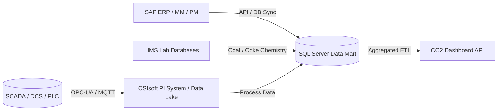

# Advanced Analytics & Next-Level Feature Roadmap

To transform the **CO₂ Dashboard** from a baseline reporting application into a world-class, enterprise-grade **Industrial Carbon Intelligence and ESG Decision-Support Platform**, you should implement the following advanced tools, charts, analytical techniques, and functional features.

---

## 1. Next-Level Data Visualizations

Enhancing Recharts or integrating specialized visualization libraries (such as D3.js or Apache ECharts) can expose hidden relationships in complex steel-plant operations:

### 🌐 Carbon Flow Sankey Diagram
*   **Concept**: Steelmaking involves complex carbon distributions. Carbon inputs (coke, coal, natural gas) enter the plant, transform into gases (BFG, COG), get recycled internally, or escape as absolute emissions.
*   **Implementation**: A Sankey diagram showing flow connections from **Sources** (Coke, Coal, Electricity, Gas) $\rightarrow$ **Operational Areas** (BF1, Sinter, Pellet, LCP) $\rightarrow$ **Outputs** (Products, Slag, Recovered Gases, Absolute Scope 1/2 Emissions). This helps operators visualize energy recovery and waste points instantly.

### 📈 Re-enable & Enhance the Correlation Scatter Chart
*   **Concept**: The current code has a commented-out scatter plot (Production Volume vs. Emission Intensity). Re-enabling this and adding statistical features would provide diagnostic value.
*   **Additions**:
    *   **Regression Trendline**: Draw a mathematical regression line (linear or logarithmic) through the scatter dots.
    *   **Interactive Quad-rant Analysis**: Divide the scatter chart into four quadrants (e.g., High Volume / Low Intensity = *Optimal*; Low Volume / High Intensity = *Inefficient*).
    *   **Dot Sizing (Bubble Chart)**: Scale the size of each dot based on total absolute emissions for that day to show volumetric scale alongside intensity ratios.

### 🗺️ Temporal & Heatmap Charts
*   **Plant-Daily Heatmap**: A 2D grid plotting days of the month on the X-axis against plant sectors on the Y-axis, colored by emission intensity. This allows quick identification of specific days or weeks when multiple sectors suffered spikes (e.g., during plant shutdown/turnaround cycles).
*   **Shift-wise Performance Boxplots**: Box-and-whisker plots showing emission intensity distributions broken down by operating shifts (Shift A, B, C) to identify if specific operating teams or handover periods run more efficiently.

---

## 2. Advanced Analytical Techniques

Move beyond simple averages (`SUM / SUM`) to predictive and diagnostic statistical models:

### 🔮 Predictive Forecasting Models
*   **Concept**: Forecast emission trajectories for the upcoming 30, 90, and 365 days.
*   **Technique**: Implement time-series forecasting (e.g., ARIMA, Prophet, or LSTM neural networks) integrated with the production scheduling system. 
*   **Value**: Allows management to foresee if the plant is on track to exceed its annual carbon allocation and adjust production/maintenance schedules proactively.

### 🚨 Statistical Anomaly Detection
*   **Concept**: Automatically highlight abnormal emission events (outliers) that require operational investigation.
*   **Technique**: Run a rolling Z-score or Isolation Forest algorithm on daily plant intensities. Color chart elements (e.g., lines or scatter dots) red if a day's intensity diverges by more than $\pm 2$ standard deviations from the 30-day moving average.
*   **Value**: Separates normal daily variation from critical sensor calibration errors or operational leaks.

### 🧪 Multi-Variable Correlation & Regression Analysis
*   **Concept**: Carbon intensity is driven by raw material quality.
*   **Technique**: Run multivariate linear regression to correlate emission intensity against material inputs (e.g., ash content in coal, iron ore grade, moisture in coke, and scrap steel ratio in charge).
*   **Value**: Proves mathematically how much raw material quality degrades carbon performance, enabling data-driven procurement.

---

## 3. High-Value Enterprise Features

To make the dashboard a key ESG tool, several functional modules should be added:

### 🎛️ "What-If" Scenario Simulator
*   **Concept**: A sandbox simulator for operations engineers and plant managers.
*   **Use Cases**:
    *   *"What if we increase the Scrap Charging ratio in SMS-2 by 15%? How will that affect our overall Net Scope 1 emissions?"*
    *   *"What if we shift 30% of our power purchase from grid coal-power to solar (reducing Scope 2 emission factor by 40%)? What is the impact on tCO₂/tCS?"*
*   **Interface**: Interactive sliders for adjusting raw material mixes, fuel types, and power grids, recalculating real-time intensity forecasts.

### 📋 Automated ESG Framework Reporting
*   **Concept**: The application should auto-generate compliance reports matching major frameworks.
*   **Key Standards**:
    *   **CBAM (Carbon Border Adjustment Mechanism)**: Generate CBAM-compliant emission reports required for exporting steel products to the EU.
    *   **BRSR (Business Responsibility and Sustainability Reporting)**: Auto-fill carbon/energy tables for Indian regulatory compliance.
    *   **SBTi & GHG Protocol**: Generate formal Scope 1 and Scope 2 emission inventory breakdowns for annual audits.

### 🔍 Scope 3 Value Chain Tracker
*   **Concept**: Currently, the dashboard tracks Scope 1 (Direct fuel/chemical reactions) and Scope 2 (Purchased electricity/steam). Up to 70% of a company's total footprint can reside in Scope 3.
*   **Feature**: Add modules to estimate emissions from upstream transportation, raw material extraction (purchased iron ore/coking coal mining footprint), and end-of-life disposal.

### 🪙 Carbon Pricing & Financial Liability Tracker
*   **Concept**: Assigning financial values to carbon makes emissions data tangible to C-suite executives.
*   **Feature**: Configure an internal shadow carbon price ($ per tonne). Compute the financial cost of current emissions under potential carbon trading schemes (such as the Indian Carbon Market or EU ETS) to guide capital investment decisions.

---

## 4. Systems Integration Strategy

Integrating the application with the industrial data ecosystem eliminates manual uploads and ensures data accuracy:

*   **LIMS (Laboratory Information Management System)**: Pull coking coal and PCI carbon/ash analyses dynamically to adjust emission factors rather than using static constants.
*   **SAP ERP**: Fetch purchasing logs to correlate raw material costs with carbon footprints.
*   **Industrial IoT (OSIsoft PI / OPC-UA)**: Establish data connectors to ingest real-time furnace telemetry (gas flow rates, temperatures) to transition the dashboard from daily/monthly reporting to a live monitoring screen.
*   **Centralized Alerting**: Connect with MS Teams, Slack, or SMS to send notifications to energy managers when daily emissions exceed baseline thresholds.
