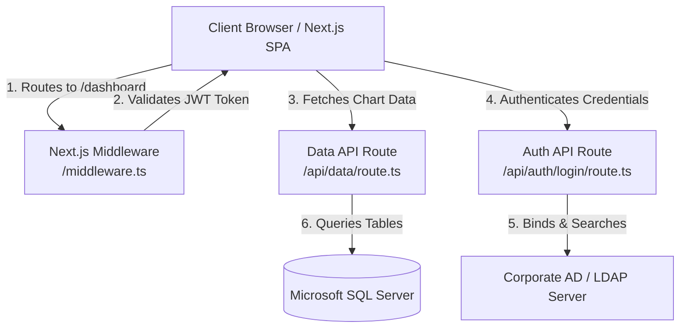

# CO₂ Dashboard — Enterprise Assessment & Optimization Roadmap

This document provides a technical assessment of the **CO₂ Monitor** codebase. It outlines the current system architecture, identifies security vulnerabilities and performance bottlenecks, and provides a clear, actionable roadmap for transitioning this application to an enterprise-grade standard.

---

## 1. Project Architecture Overview

The current project is a **Next.js 14** application designed to monitor carbon emissions, production quantities, and crude steel metrics across multiple plant sectors (e.g., Blast Furnaces, Pellet Plants, Sintering Plants).



### Key Components
*   **Frontend SPA**: Built with React (Client Components), Tailwind CSS, Framer Motion, and Recharts. State is managed locally using **Zustand** (`lib/store.ts`).
*   **Database Integration**: Communicates directly with Microsoft SQL Server (`mssql` client) using a customized column-mapping parser (`lib/parser.ts`) to adapt database schemas dynamically.
*   **Authentication**: Authenticates user credentials against an Active Directory/LDAP server (`ldapts`) and issues a JSON Web Token (JWT) stored in a client-side HTTP-only cookie.
*   **Security Gatekeeping**: A Next.js Middleware (`middleware.ts`) protects pages by checking for the presence of the JWT token.

---

## 2. Security & Compliance Gaps (Critical)

To make the application ready for enterprise deployment, several security gaps must be addressed:

### 🚨 Unauthenticated API Access (Auth Bypass)
*   **Problem**: While [middleware.ts](file:///d:/co2_monitor/middleware.ts) protects the `/dashboard` and `/elaborate` page routes, it does **not** protect the `/api/data` route. The middleware configuration evaluates target paths and exits early if a route is not in `PROTECTED_ROUTES = ['/dashboard', '/elaborate']`.
*   **Impact**: Anyone on the corporate network can query `/api/data` directly via `curl` or their browser, downloading the entire plant performance, emissions, and crude steel history without logging in.
*   **Solution**: Protect `/api/data` directly in [middleware.ts](file:///d:/co2_monitor/middleware.ts) by adding `/api/data` to the protected paths, or check and verify the JWT cookie directly inside [app/api/data/route.ts](file:///d:/co2_monitor/app/api/data/route.ts).

### 🔒 Disabling LDAP TLS Validation
*   **Problem**: In [app/api/auth/login/route.ts](file:///d:/co2_monitor/app/api/auth/login/route.ts#L99-L103), the LDAP connection is configured with `rejectUnauthorized: false` to allow self-signed certificates.
*   **Impact**: This leaves the LDAP binding process vulnerable to **Man-in-the-Middle (MitM)** attacks, allowing credentials to be intercepted on the network.
*   **Solution**: Secure internal directory servers properly. Bind connections using the company's internal Certificate Authority (CA) root bundle. Load the CA certificate in the server environment (e.g., using Node's `NODE_EXTRA_CA_CERTS` or reading the CA certificate file manually) and set `rejectUnauthorized: true`.

### ⚠️ Volatile In-Memory Security State
*   **Problem**: Failed login tracking, IP lockout, and username lockout maps are held in-memory (`Map` instances) in [lib/auth-security.ts](file:///d:/co2_monitor/lib/auth-security.ts#L20-L21).
*   **Impact**: If the application is hosted in a serverless environment (e.g., Vercel, AWS Lambda) or a containerized environment with multiple replica pods behind a load balancer:
    1.  The security maps are not shared between instances (allowing attackers to bypass lockouts by hitting different server nodes).
    2.  Serverless instances wipe global states on cold starts, resetting the block counters.
*   **Solution**: Move the rate limiting and lockout state to a shared database-backed schema or a distributed cache like **Redis** (e.g., using `ioredis` or a library like `rate-limiter-flexible`).

### 🔑 Insecure Secret Fallbacks
*   **Problem**: The JWT authentication library defaults to `'dev-secret'` if `JWT_SECRET` is missing.
*   **Impact**: If an administrator forgets to set the secret in production, token signing is highly insecure and trivial to forge.
*   **Solution**: The application must fail loud during startup or request processing if essential security environment variables (like `JWT_SECRET`) are missing.

---

## 3. Performance & Resource Optimization

Optimizations to prevent database overload and client-side rendering performance bottlenecks:

### ⚙️ Database Connection Pooling in Next.js Serverless
*   **Problem**: In [lib/db.ts](file:///d:/co2_monitor/lib/db.ts#L71-L84), `getPool()` creates a new `ConnectionPool` on the fly. During development hot-reloads, or in autoscaling environments, Next.js routes are executed in isolated compilation contexts. This can trigger the instantiation of multiple redundant connection pools, leading to port exhaustion and database locking.
*   **Solution**: Attach the database pool instance to the global execution context (`globalThis`) to preserve it across hot reloads.
    ```typescript
    // Example pattern for Next.js Global Pool caching:
    let pool: sql.ConnectionPool;
    if (process.env.NODE_ENV === 'production') {
      pool = new sql.ConnectionPool(config);
    } else {
      if (!global.mssqlPool) {
        global.mssqlPool = new sql.ConnectionPool(config);
      }
      pool = global.mssqlPool;
    }
    ```

### 🏎️ Sargable Queries (Index Optimization)
*   **Problem**: The database query builder in [lib/parser.ts](file:///d:/co2_monitor/lib/parser.ts#L174) contains:
    `WHERE CAST(dateColumn AS date) BETWEEN CONVERT(date, @start) AND CONVERT(date, @end)`
*   **Impact**: Applying a function (`CAST(...)`) to a database table column in a search condition prevents SQL Server from performing index seeks on that column, forcing a full table scan.
*   **Solution**: Modify the query to perform date comparisons on raw columns without casting:
    `WHERE dateColumn >= @start AND dateColumn <= @end`
    Ensure that the columns mapped to date fields are properly indexed in the database.

### 📊 Heavy Memory Computations in Frontend JavaScript
*   **Problem**: In [lib/compute.ts](file:///d:/co2_monitor/lib/compute.ts), calculations (such as `computeKPI`, `computePieData`, `computeTimeline`, etc.) use array iterators (`filter`, `reduce`, `map`) directly in the client application's memory.
*   **Impact**: For large historical ranges (e.g., years of daily data from 17 plants), processing thousands of records on the client's browser main thread will cause UI stuttering and high memory consumption.
*   **Solution**: Offload aggregation to the database. Instead of querying raw rows (`SELECT *`), build a database interface that performs operations like `SUM()` and `GROUP BY` inside SQL Server.

### 🌐 Inefficient Caching Check
*   **Problem**: The server implements an HTTP `304 Not Modified` handler. However, to construct the `lastModified` timestamp, the backend must first execute all database queries and scan the results in JavaScript (`deriveLastModified`).
*   **Impact**: Even if the client gets a `304 Not Modified` (and downloads 0 bytes of payload), the database is still queried for the full dataset every 30 seconds.
*   **Solution**: Query a metadata table, or use a lightweight query checking only the max modification date:
    `SELECT MAX(last_modified_date) FROM Table`
    Only fetch the full dataset if this date is newer than the client's cached timestamp.

---

## 4. Path to Enterprise Level

To transition this monitoring dashboard into a robust enterprise platform, consider integrating the following features and architectural patterns:

### A. Data Architecture & ETL Pipelines
Direct transactional querying can degrade database performance. For enterprise workloads:
*   **Data Warehouse**: Shift the data source from operational tables to a dedicated warehouse (e.g., Snowflake, BigQuery) or a structured Data Mart.
*   **Daily ETL/ELT**: Run a nightly ETL pipeline (using tools like Apache Airflow or dbt) that aggregates raw sensor and plant records into pre-calculated hourly/daily summaries. The dashboard then queries these lightweight tables instantly.

### B. Access Control & Audit Trails
*   **Role-Based Access Control (RBAC)**: Define granular roles (e.g., `Plant Manager`, `Corporate ESG Auditor`, `Operator`). Bind these roles to Active Directory Security Groups. During LDAP login, extract the user's groups and inject their role into the JWT claims to restrict dashboard views.
*   **Audit Logging**: Log all user actions, particularly data exports and login attempts, into a secure database table or audit log system (SIEM) for compliance.

### C. Advanced Observability & Monitoring
*   **Structured Logging**: Replace standard `console.log` statements with a structured, fast logger (e.g., `Pino` or `Winston`) that outputs JSON logs.
*   **Log Ingestion**: Pipe logs to a centralized collector like Elasticsearch, Datadog, or Splunk.
*   **Health Check Endpoints**: Implement a `/api/health` route that monitors database latency, LDAP availability, and system resources. Connect this route to alerts that notify your operations team in case of service failures.

### D. Testing & Quality Assurance
Enterprise deployments require robust test coverage to prevent regression issues:
*   **Unit Tests**: Use `Jest` or `Vitest` to validate calculations in `lib/compute.ts`.
*   **Integration Tests**: Verify authentication and database routes using mock databases.
*   **E2E Tests**: Use `Playwright` to test user dashboard flows (filtering, theme toggling, date range selection) against key browser environments.

### E. Configuration & Secrets Management
*   Do not store plaintext passwords or Active Directory credentials in raw environment variables.
*   Integrate secret managers (e.g., HashiCorp Vault, Azure Key Vault, AWS Secrets Manager) to dynamically inject database passwords and LDAP secrets at startup.
